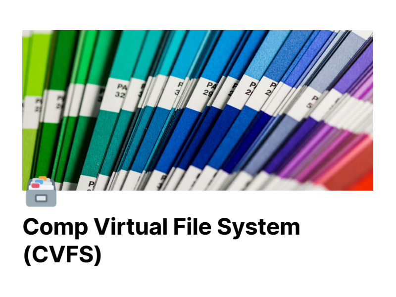
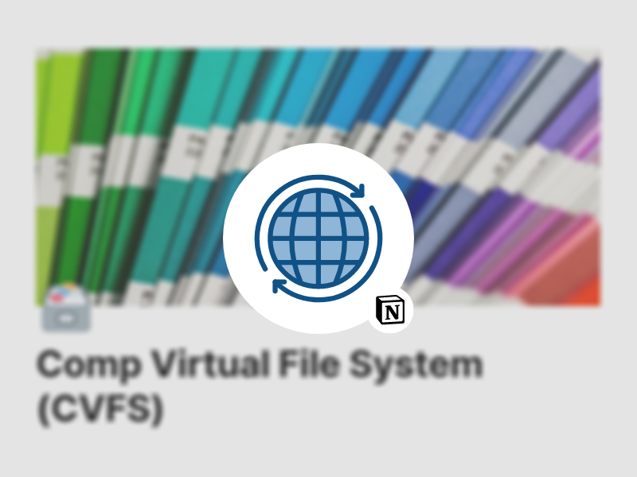

# COMP2021_Group_Project

## Group Project: Comp Virtual File System

PolyU COMP2021 Object-Oriented Programming *2020-21 Fall*

The goal of this project is to develop an in-memory Virtual File System (VFS), named the CompVFS (CVFS), in Java. A VFS is usually built on top of a host file system to enable uniform accessto files located in different host file systems, while the CVFS simulates a file system in memory. You can find more information about VFSs on Wikipedia.

## Team

This group consists of four members (in alphabetical sequence).
- [MAN Furui](https://github.com/StrFreeman)
- [WANG Meng](https://github.com/Moenupa)
- [XING Shiji](https://github.com/toolsmax0)
- [ZHANG Yubo](https://github.com/Yb-Z)

## Docs

This section contains the docs (or doc-links) with explanation the codes.

    <a href="./docs/project_description.pdf" target="_blank"></img></a>
    <a href="./docs/IntelliJ%20IDEA%20Tutorial.pdf" target="_blank"></img></a>
    <a href="./docs/Comp_Virtual_File_System_(CVFS).pdf" target="_blank"></img></a>
    <a href="https://www.notion.so/moenupa/Comp-Virtual-File-System-CVFS-ac5846a342064f7f88ad9361e6e088d8" target="_blank"></img></a>

## License

[GPL 3.0](./LICENSE)